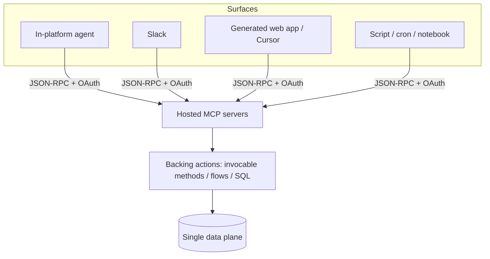

# Headless Multi-Surface MCP Tool-Plane — Architecture Template

Publish a capability **once** as hosted MCP tools, then consume it from **N completely different surfaces** (an in-platform agent, Slack, a generated web app, a script) over the same JSON-RPC contract. "One data plane, many callers." The opposite of building a bespoke integration per surface.

> Source pattern: FWA "Headless 360" — two Salesforce Hosted MCP servers backing a Slack agent, a React app, and Cursor
> (`FWA-Project/docs/headless-360-build-plan.md`, `docs/phase_3/phase3-customer-demo-prompt.md`, `demo/CLAUDE.md`).

---

## The shape

## Core principles

1. **One contract, many consumers.** Each surface authenticates (OAuth/ECA) and calls the **same** tools. No surface re-implements business logic.
2. **Boundary rule — pick the caller by intent:**
   - *Conversational + decision-bearing* → route through the **agent** (traced, posts back in-thread).
   - *Pure data fetch from a non-conversational client* → call the **MCP tool directly**.
3. **Least-privilege per server.** Split capability across servers by risk: one read-only, one write-capable. Each gets its own client app + permission set. `{{READONLY_SERVER}}` = reads; `{{WRITE_SERVER}}` = creates/updates only.
4. **Keep the tool surface tight.** Every unused tool schema bloats context and invites speculative calls. Register only the tools a use case needs; serve reference content as **MCP resources**, not tools.
5. **Self-describing > bespoke REST.** The client discovers tools/schemas/resources at runtime; the same contract serves both an LLM agent and a human-built UI.

## Build checklist

- [ ] Define the **tool inventory** (name → purpose → backing action). Keep names short — combined `server+tool` strings can hit length caps.
- [ ] Split into a **read-only** and a **write** server; scope a permission set to the minimum for each.
- [ ] Register an **External/Connected App** per server with the narrowest OAuth scopes.
- [ ] Move reference docs/definitions to **resources** (`{{scheme}}://...`), not tools.
- [ ] Prove **≥2 surfaces** against the same tools before calling it "headless" (e.g. agent + a generated client).
- [ ] (If audited) wire a **trace** the conversational surface can fetch and post back inline.

## Per-project fill-in

| Tool | Backing action | Server | Read/Write |
|---|---|---|---|
| `{{tool_a}}` | `{{action}}` | `{{READONLY_SERVER}}` | R |
| `{{tool_b}}` | `{{action}}` | `{{WRITE_SERVER}}` | W |

## Why it matters (the pitch)
"From prompt to running app in minutes — the data, the model, the write-backs were never rebuilt. Published once as MCP tools; any client uses them. The next surface could be mobile, a script, a partner integration. The work is already done."

---

### When NOT to use
- A single surface with no reuse horizon — a direct integration is simpler.
- Capabilities that can't be safely exposed over per-user OAuth, or that need surface-specific logic that doesn't belong in a shared tool.

### Pairs with
- **P10** (text-only API hybrid UI) for the *client-side* rendering when a surface's API returns text only.
- **P19** (live-demo runbook) to demo the multi-surface story on stage.
- **R10** (verification/confidence protocol) so tools query verified schema, not guesses.
- **S4** (data-cloud-sql-runner) when a surface is Data Cloud.
